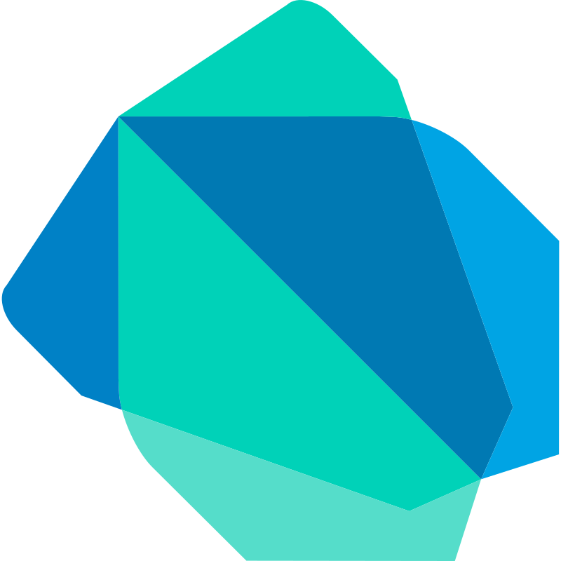
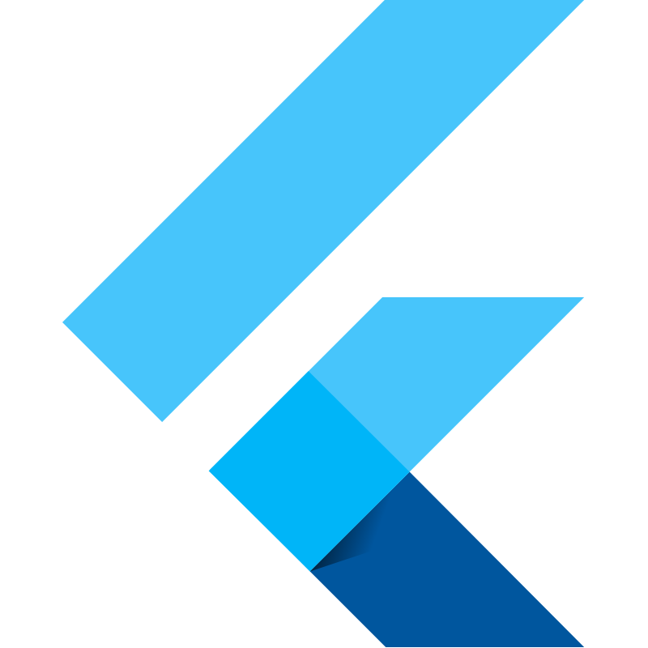

  

## Introduction

feel free to read this:
 

I am a highly motivated cybersecurity enthusiast and a recent CS graduate with a strong desire to learn & grow, especially in cybersecurity. For my graduation project, I developed an app using the [Flutter framework](https://flutter.dev/) and [Firebase database](https://firebase.google.com/), which helped me gain experience in software development. Currently, I'm studying for the [Security+ certification](https://www.comptia.org/certifications/security) to solidify my foundation. Following that, I plan to pursue further certifications in the field.

------------

## Skills and Tools

I'd like to hope I'm competent, Here are some stuff I've usedI'm proud to present my graduation project: an app I built using Flutter and Firebase. The app is a student portal that has many useful features for college students.

### Languages:

    

### Frameworks, Libraries, and Similar:

    

### Tools:
        

------------

## CTF Writeups

A writeup is just My thought process during solving CTF's ,I like CTFs, I learn a lot from them

I plan to do more CTFs and include major ones soon.  
|Repository|Description|
|-|-|
|| Current Stats picoGym Score: 3780|

------------

## Projects

Here are some of my projects

  
|Repository|Description|
|-|-|
|| **Some of the features are:**/  - Signing up and logging in with secure authentication - Viewing your GPA, debts, subjects, and exam results in one place  - Getting general info about the college, such as events, news, and contacts  - Accessing the app from any device with an internet connection |

------------

### Hackathons

  

I'll update this later as soon as i win some Hackathons <a href="https://devpost.com/alnaagi>Devpost</a>"

  

------------

### Where to Find Me

For people who need to find me for legit reasons
 

   

------------

## Here's some cool Stats:

<!---->

<!--
## Credits

If you want to know where all these readme widgets and cool stuff came from:

* Theme I use for all widgets: [Tokyo Night](https://marketplace.visualstudio.com/items?itemName=enkia.tokyo-night)
* Header image from [DenverCoder1/readme-typing-svg](https://github.com/DenverCoder1/readme-typing-svg)
* Visitor badge from [jwenjian/visitor-badge](https://github.com/jwenjian/visitor-badge) (no longer works :( unfortunate)
* SVG icons with more than one colour on it from either [devicons/devicon](https://github.com/devicons/devicon) or [VectorLogoZone](https://www.vectorlogo.zone/)
* other SVG icons from [simple-icons/simple-icons](https://github.com/simple-icons/simple-icons), I added a fill for colours
* Top languages, Github stats, and Github repos from [anuraghazra/github-readme-stats](https://github.com/anuraghazra/github-readme-stats)
* Coding streak from [DenverCoder1/github-readme-streak-stats](https://github.com/DenverCoder1/github-readme-streak-stats)
* Contribution graph from [ashutosh00710/github-readme-activity-graph](https://github.com/ashutosh00710/github-readme-activity-graph)
* Recent Github activity from [jamesgeorge007/github-activity-readme](https://github.com/jamesgeorge007/github-activity-readme)
* Github profile trophies from [ryo-ma/github-profile-trophy](https://github.com/ryo-ma/github-profile-trophy)
* Recent blog articles from [gautamkrishnar/blog-post-workflow](https://github.com/gautamkrishnar/blog-post-workflow)
* Badge board from [Holopin](https://www.holopin.io)

-->
